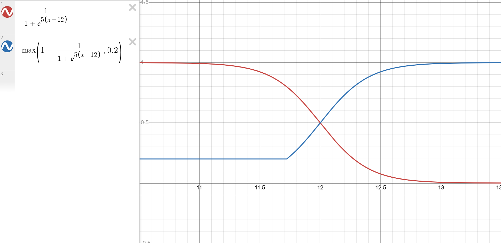

# Car Parking ML Agent

## Overview
This Unity ML-Agents project trains an AI to park a car in a parking lot. The
agent uses deep reinforcement learning and curriculum learning to progress 
from simple scenarios to more complex ones.

## Features
- Fully autonomous car parking using ML-Agents and PPO.
- Curriculum learning implemented to gradually increase difficulty.
- Random starting positions and rotations.
- Reward system encourages correct distance, angle, and orientation.

## How it works

### Training Setup
- **Observations**:
    - Car linear and angular velocity
    - Angle relative to the parking spot
    - Ray perception sensors to detect the position of the parking spot
- **Actions**:
    - Acceleration (forward / backward)
    - Steering (left / right)
    - Braking
- **Rewards**:
    - Moving toward the parking spot
    - Proper alignment and orientation
    - Parking the car
    - Penalty for collisions with the wall or other cars

### Ray Sensors Observation

The agent uses **Ray Sensors** to see its surroundings. The rays can detect walls, full parking spots and the empty parking space.

### Reward system
The most important part of training an agent using deep reinforcement learning
is setting up a good reward system that encourages the agent to progress.

A parking was considered correct if:
- The car entirely fits into the parking spot
- The car is not moving
- The angle between the car and parking spot is smaller than a threshold
(10 degrees)

The agent needs to firstly approach the parking spot and, when close enough, it
should angle itself correctly and stop. Depending on the distance to the
parking spot, the distance could be more important than angle and vice versa.
To handle this, a sigmoid function was used to determine the weight of the
rewards for distance/angle.

*Red Graph: Angle Weight*  
*Blue Graph: Distance Weight*

If the car is far away from the parking spot, the angle is negligible and
getting closer is very important. If the car is very close to the parking spot,
getting the right angle is more important, but distance is still somewhat
important, as a perfect parking requires the whole car to be inside the spot.

The reward for distance and angle can get up to `1 point` each.

After reaching the parking spot, the agent is rewarded `0.5 points` for the 
first time it touches the spot and `1.5 points` if it parks correctly.

To encourage the agent to explore the environment, it was rewarded each time
it moved for up to a maximum of `1 point` per episode.

A perfect parking can get to a total of `4 points`, but it is unlikely because
a penalty is applied each step (up to `0.2 points` per episode) to discourage 
the agent to stand still.

### Curriculum learning
The agent starts with a fixed position and rotation in an environment 
containing a single empty parking spot placed at a random position and needs 
to complete various lessons to progress to more complex scenarios.

The 3 variables used to gradually increase difficulty are:
- Initial position
- Initial rotation
- Number of full parking spots

There are 3 position/rotation lessons are passed after the agent consistently 
surpasses 3 points.

The full parking lessons are harder, so the agent can start those only after 
finishing all position/rotation lessons.

## Running the training
Prerequisites:
- Unity 6000.1.8f1
- mlagents 1.1.0
- Python 3.10

In order to run the training, run this command in the root directory:
    
    mlagents-learn config/carParking.yaml --env="Builds/CarParkingBuild_24env/Car Parking ML Agent.exe" --run-id=RUN_ID 

This is a graphic-less build containing 24 environments. To run more
environments for a faster training (but more hardware expensive), you can
add the option **--num-env=X**. To resume training on the same ID, use
**--resume**.

## Results

*Click the GIF to see the full training video*

### Graphs

The agent was trained for `~34 million steps`, where it capped at a score of 
`~3.8 points`.

The first episodes are very slow, as the agent doesn't know how to park yet,
but it learns very quickly to avoid hitting the wall, which results in long
episodes.

In the **Cumulative Reward** graph, the spikes correspond to a passed lesson.
After the spike, the difficulty of the challenge increases, and the model
performs poorer for a while, until it learns to adapt to the new environment.

One big decrease in performance is seen at the `18.5M step`, where full parking
spots were introduced for the first time and the model didn't know how to 
react.

After no more lessons need to be passed, the cumulative reward graph becomes
logarithmic and the performance stabilizes at around `3.8 points` out of the 
total maximum of `4 points`.